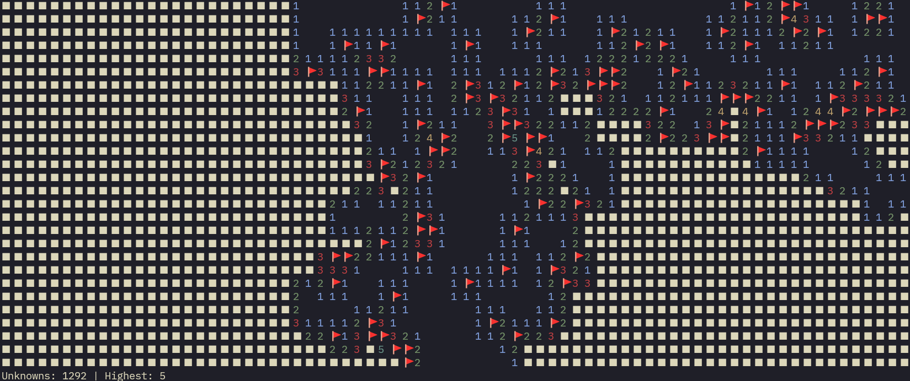

# Minesweeper solver



This is a simple minesweeper solver.

The code is highly unoptimized. It is just a proof of concept made for fun in a
couple of hours.

## How to use

> Tip: running the solver with a big enough board will make for grate visuals.

1. Install the requirements:

```bash
cargo install --path .
```

2. Run the solver:

```bash
cargo run
```

## How it works

The solver looks for cases where the number of mines is equal to the number of
hidden cells. In these cases, all hidden cells are mines.

Those cells get flagged.

Another pass is made to look for cases where the number of hidden cells plus the
number of flagged cells is graeter than or equal to the number of mines. In
these cases, all hidden cells are safe. Those cells get revealed.

The process is repeated until no more cells can be flagged or revealed.

If the solver gets stuck, it will randomly reveal a hidden cell.

## TODO

- [ ] Variable dimensions
- [ ] Variable number of mines
- [ ] Solutions for cases on edges other than the corners
- [ ] Various optimizations
